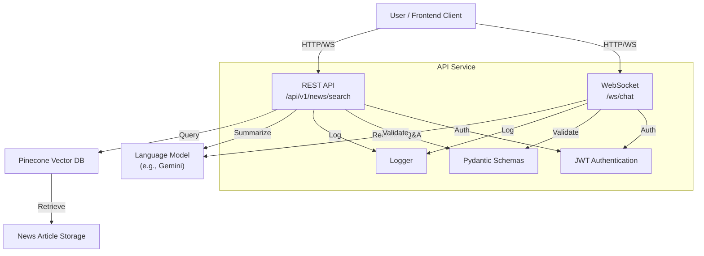

# Real-Time-News-Agent: Backend Service

In a world where news breaks and evolves rapidly, staying informed in real time is crucial. The Real-Time-News-Agent backend service is designed to autonomously monitor news APIs, aggregate and index articles, and provide users with instant, summarized, and context-aware responses to their queries about developing events. This empowers users, organizations, and applications to access up-to-date, relevant news insights with minimal latency and maximum accuracy.

## What

This backend service is built with FastAPI and serves as the core API and real-time communication layer for the Real-Time-News-Agent system. It exposes REST and WebSocket endpoints for:

- Searching and retrieving news articles based on user queries.
- Enabling real-time chat for interactive Q&A and summarization.
- Managing authentication and secure access via JWT tokens.

The service integrates with a vector database (Pinecone) for semantic search and leverages a language model (e.g., Gemini) to generate high-quality summaries and answers.

---

## System Design

### High-Level Architecture



### Component Breakdown

- **User/Frontend Client:** Interacts with the backend via REST and WebSocket endpoints.
- **API Service:** Built with FastAPI, it handles all HTTP and WebSocket requests, authentication, validation, and logging.
- **Pinecone Vector DB:** Stores and indexes news articles for fast semantic search.
- **Language Model (Gemini):** Generates summaries and answers based on user queries and retrieved articles.
- **News Article Storage:** Persistent storage for ingested news articles.
- **Logger:** Centralized logging for monitoring and debugging.

### Flow

1. **User Query:** The user sends a search or chat query via REST or WebSocket.
2. **Authentication:** The service validates the JWT token.
3. **Semantic Search:** The query is used to search the Pinecone vector database for relevant articles.
4. **Language Model:** The most relevant articles are passed to the language model to generate a summary or answer.
5. **Response:** The result is returned to the user in real time.
6. **Logging:** All interactions are logged for monitoring and analysis.

---

## API Endpoints

### 1. `POST /api/v1/news/search`

- **Description:** Search news articles by user query.
- **Request:**
  ```json
  { "query": "string", "limit": 10 }
  ```
- **Response:**
  ```json
  {
    "results": [
      { "title": "string", "url": "string", "summary": "string", "published_at": "ISO8601 timestamp" }
    ]
  }
  ```
- **Errors:**
  - `400`: Invalid input
  - `500`: Server error
- **Authentication:** JWT in `Authorization` header

---

### 2. `ws://<host>/ws/chat`

- **Description:** Real-time chat for user queries and bot responses.
- **Connection:**
  - JWT token as query param or header
- **Message Format:**
  ```json
  { "type": "user_message", "content": "string" }
  ```
- **Response Format:**
  ```json
  { "type": "bot_response", "content": "string" }
  ```
- **Error Format:**
  ```json
  { "type": "error", "message": "Details" }
  ```

---

## General Notes

- **Authentication:** All endpoints require JWT authentication.
- **Error Handling:** Consistent JSON error format:
  ```json
  { "error": "InvalidRequest", "message": "Details about the error." }
  ```
- **Schemas:** All requests and responses are validated using Pydantic models.
- **Testing:** Unit tests are written using FastAPI’s TestClient and are located in `api-service/tests/`.
- **Documentation:** OpenAPI docs are auto-generated and should be kept up to date.
- **Collaboration:** Always confirm request/response formats with frontend developers before release.

---

For more details on endpoint flows and integration, see `api-service/flow.md` and `api-service/ENDPOINTS.md`.
